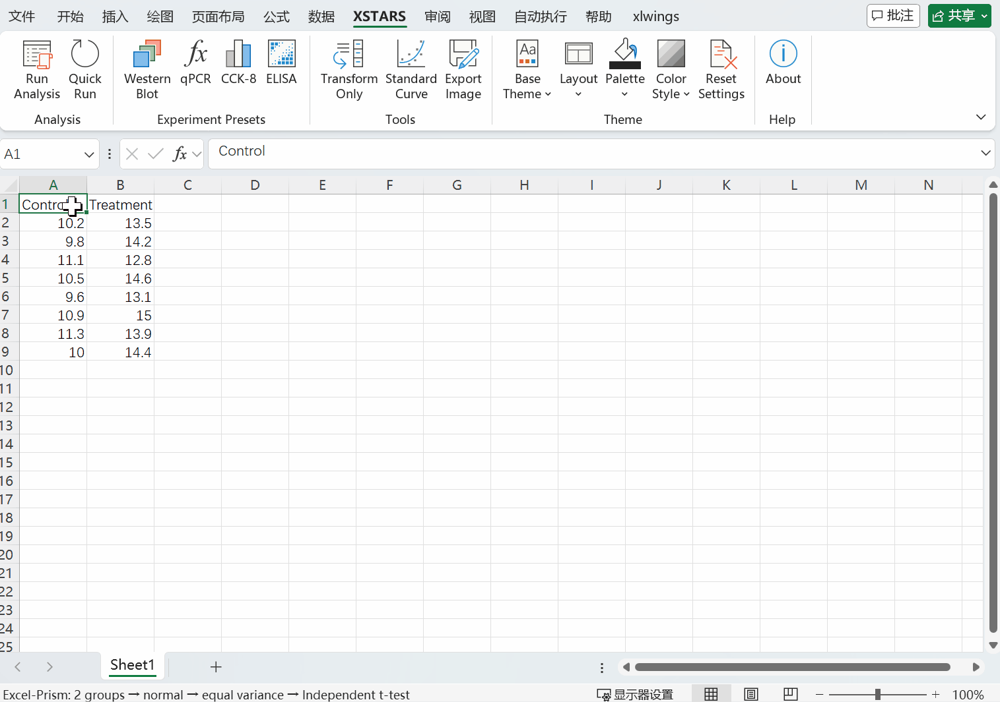
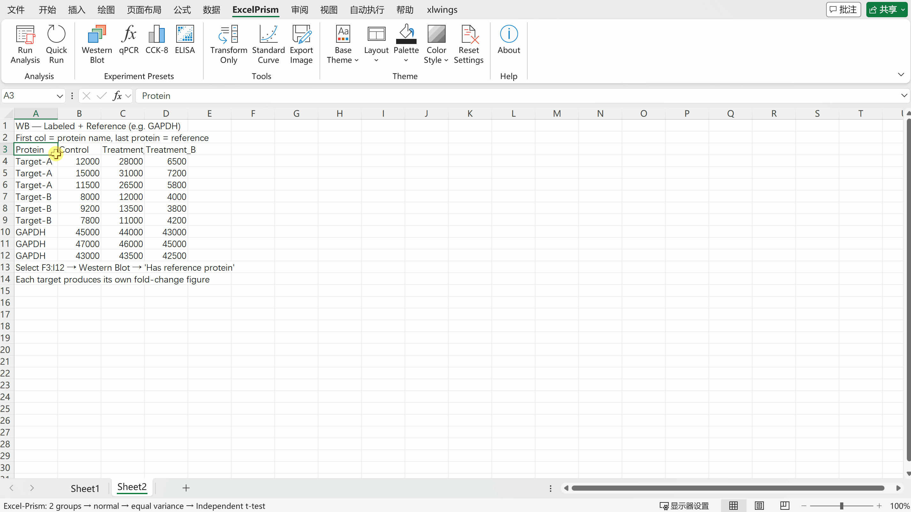
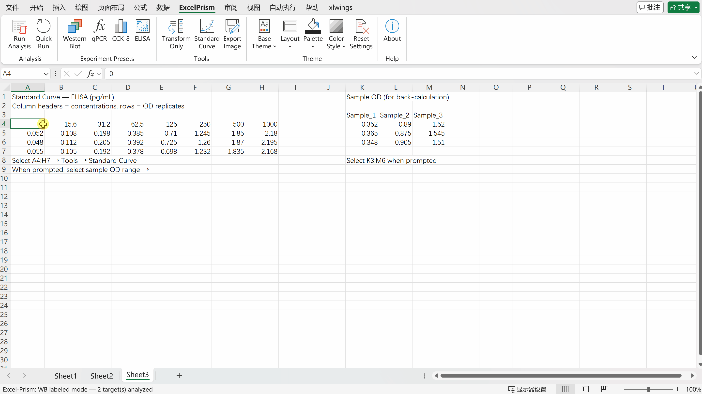

<h1 align="center">✨ XSTARS</h1>

<p align="center">
  <strong>Excel-based Statistics Tool for Analysis, Rapid Significance - in one click</strong><br>
  <em>See the stars in your data.</em>
</p>

<p align="center">
  🔄 Zero switching · 🧠 Zero barrier · 💰 Zero cost
</p>
<p align="center">
  <a href="https://github.com/Frankkk1912/xstars/releases">📥 Download Installer</a> ·
  <a href="README.zh-CN.md">🇨🇳 中文文档</a> ·
  <a href="#-quick-start">🚀 Quick Start</a> ·
  <a href="https://youtu.be/RYQnUziHH7Q?si=7PG5P3-cC38gZ2YY"> 📺 Demo Video</a> ·
</p>


---

## 🤔 Why XSTARS?

> 🎓 Your lab meeting is tomorrow. You just finished a Western blot and the band intensities are in Excel. Now you need to: open Prism, paste the data, pick the right statistical test, tweak the figure style, export it, paste it into your slides… An hour later, you've spent more time on the figure than on the experiment itself.
>
> **What if all of that took just one click — right inside Excel?**

**XSTARS** is a free Excel add-in that generates publication-quality charts with automatic statistical testing — directly inside your spreadsheet. No new software to learn, no data to export, no code to write.

### 😩 The Problem

| Pain point | Before XSTARS |
|---|---|
| 🔀 Tool switching | Copy data from Excel → paste into Prism/R → make figure → paste back into manuscript |
| 🤯 Choosing statistics | "Should I use t-test or Mann-Whitney?" — manually check normality, decide, hope it's right |
| 💸 Cost | GraphPad Prism: ~$300/year (student), ~$600+ (academic). Or use a pirated copy and worry |
| 📚 Learning curve | R/Python: weeks of learning. Prism: a new interface to master |

### 💡 The Solution — Three Zeros

| | What it means |
|---|---|
| 🔄 **Zero Switching** | Select data in Excel → click → figure appears in Excel. Your data never leaves |
| 🧠 **Zero Barrier** | Auto-detects normality & variance → picks the right test → draws significance brackets. You don't choose |
| 💰 **Zero Cost** | Free and open-source. One installer, no Python required, no license fees |

---

## 🎬 Demo

### ⚡ Quick Run — One click, instant figure


---

## ⚔️ XSTARS vs. Alternatives

| | XSTARS | GraphPad Prism | R / Python |
|---|:---:|:---:|:---:|
| **💰 Price** | 🟢 Free | 🔴 ~$300–600/yr | 🟢 Free |
| **📊 Works inside Excel** | ✅ | ❌ | ❌ |
| **🖱️ No coding required** | ✅ | ✅ | ❌ |
| **📦 No Python/R install** | ✅ (standalone .exe) | N/A | ❌ |
| **🤖 Auto stat test selection** | ✅ | ❌ Manual | ❌ Manual |
| **📐 Significance brackets** | ✅ Automatic | ⚠️ Manual placement | ❌ Code required |
| **🧪 Experiment presets** | ✅ WB, qPCR, CCK-8, ELISA | ❌ | ❌ Build your own |
| **🎨 Journal-matched themes** | ✅ 1,500+ style combinations | ⚠️ Limited | ❌ Code required |
| **⏱️ Learning time** | 🟢 Minutes | 🟡 Hours | 🔴 Weeks |

> 💬 XSTARS is not trying to replace Prism for every use case. It focuses on the **most common lab scenario**: you finished an experiment, your data is in Excel, and you need a publication-quality figure with correct statistics — fast.

---

## 🧰 Features

### 📊 Chart Types
- **Bar + Scatter** — Mean bars with error bars (SEM / SD / 95% CI) and individual data points
- **Violin** — Distribution shape with optional scatter overlay
- **Line** — Group means connected by lines

### 🤖 Automatic Statistical Testing

No more guessing which test to use. XSTARS runs a decision tree on your data:

```
For each group: Shapiro-Wilk normality test
       ↓
Across groups: Levene's test for equal variance
       ↓
Auto-select the appropriate test:
```

| Condition | 2 Groups | ≥ 3 Groups |
|-----------|----------|------------|
| Normal + Equal variance | t-test | ANOVA + Tukey HSD |
| Normal + Unequal variance | Welch's t-test | Welch's ANOVA + Games-Howell |
| Non-normal | Mann–Whitney U | Kruskal–Wallis + Dunn |
| Paired (normal) | Paired t-test | — |
| Paired (non-normal) | Wilcoxon signed-rank | — |

Significance brackets (`*`, `**`, `***`, `****`, or exact p-values) are drawn automatically. ✨


> ⚠️ **Small samples (N < 5):** Normality tests are unreliable at very small N — XSTARS skips the test and assumes normality.

### 🧪 Experiment Presets

Built-in workflows for common lab assays — no manual calculation needed:

🔬 **Western Blot**
- Normalize band intensities → fold change
- Reference protein correction (e.g., GAPDH) per lane
- Multi-target labeled mode: one figure per protein, automatic reference normalization

🧬 **qPCR (ΔΔCt)**
- Accepts ΔCt or raw Ct input
- Automatic ΔΔCt → 2^(−ΔΔCt) fold change calculation
- Multi-gene labeled mode with reference gene normalization

💊 **CCK-8 Cell Viability**
- Blank subtraction → viability %
- Optional IC50 fitting (4-parameter logistic curve)
- Dose-response curve with flexible axis scaling

🧫 **ELISA**
- Standard curve fitting (4PL/linear)
- Sample concentration back-calculation
- Supports manual parameter input for existing curves

### 🔬 Western Blot — Band quantification to fold change



### 🧫 ELISA — Standard curve fitting & concentration back-calculation



### 🎨 Journal-Ready Theme System

Four independent controls — **1,500+ style combinations** to match any journal, any aesthetic:

| Control | Options |
|---------|---------|
| **🖌️ Base Theme** | Classic · B&W · Minimal · Dark |
| **📐 Layout** | Journal typography presets — Nature · Science · Cell · Lancet · NEJM · JAMA · BMJ (figure width, font, size) |
| **🎨 Palette** | Journal-inspired color palettes (ggsci-style) |
| **💧 Color Style** | Pastel · Deep · Vibrant · Muted · Colorblind-safe |

1,500+ figure styles — Mix Base Theme × Layout × Palette × Color Style to match any journal, any aesthetic, any preference.

### 📤 Export

Save figures as **PNG**, **TIFF**, **SVG**, or **PDF** — with custom DPI up to 1200, ready for submission. 🎯

---

## 🚀 Quick Start

### Option A: 📥 Installer (Recommended — no Python needed)

1. Download `XSTARS_Setup.exe` from [Releases](https://github.com/Frankkk1912/excel-prism/releases)
2. Run the installer — it sets up the Excel add-in automatically
3. Open Excel → you'll see the **XSTARS** tab in the ribbon
4. Select your data (with headers) → click **Run** 🎉

> 💡 **New to XSTARS?** Open `XSTARS_Templates.xlsx` (included in the installer) for ready-to-run example datasets covering every chart type and experiment preset — just click Run on any sheet to see XSTARS in action.

### Option B: 🛠️ Developer Setup (Python required)

```bash
git clone https://github.com/Frankkk1912/xstars.git
cd xstars
pip install -e ".[dev]"
xlwings addin install
```

Then open your `.xlsm` workbook and add the VBA callbacks — see [ribbon/README.md](ribbon/README.md).

---

## 📋 Data Format

Organize data in **wide format** — each column is a group, each row is a replicate:

| Control | Treatment A | Treatment B |
|---------|-------------|-------------|
| 1.2     | 2.3         | 3.1         |
| 1.4     | 2.1         | 2.9         |
| 1.1     | 2.5         | 3.3         |

For multi-target experiments (WB/qPCR labeled mode), add a label column:

| Label  | Control | Treatment A | Treatment B |
|--------|---------|-------------|-------------|
| EGFR   | 1.2     | 2.3         | 3.1         |
| EGFR   | 1.4     | 2.1         | 2.9         |
| GAPDH  | 1.0     | 1.0         | 1.1         |
| GAPDH  | 1.1     | 0.9         | 1.0         |

Select the range (including headers) → click Run. That's it. ✅

---

## ⚙️ Settings

All options are in a tabbed dialog:

| Tab | Options |
|-----|---------|
| **⚡ General** | Chart type, error bars, data points, paired mode, annotation format, comparison mode |
| **🎨 Theme** | Base Theme · Layout · Palette · Color Style (each independently adjustable from the ribbon) |
| **🧪 Preset** | Experiment type (WB / qPCR / CCK-8 / ELISA) and specific options |
| **📤 Export** | Output format, DPI, file path |

Settings persist across sessions in `~/.xstars/settings.json`. 💾

---

## 📌 Requirements

- 🪟 Windows with Microsoft Excel
- **Installer mode**: Nothing else — the `.exe` bundles everything
- **Dev mode**: Python ≥ 3.10

---

## 🤝 Contributing

Issues and pull requests are welcome!

## 📄 License

[MIT](LICENSE) — free for academic and commercial use.

---

<p align="center">
  <sub>⭐ XSTARS — Excel-based Statistics Tool for Analysis, Rapid Significance · See the stars in your data.</sub>
</p>
