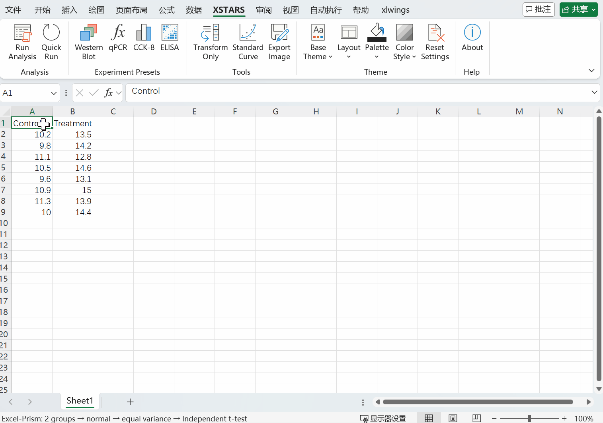
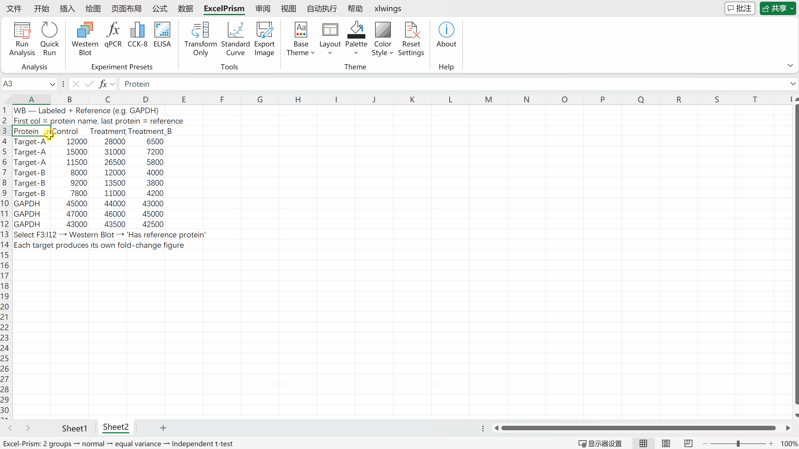
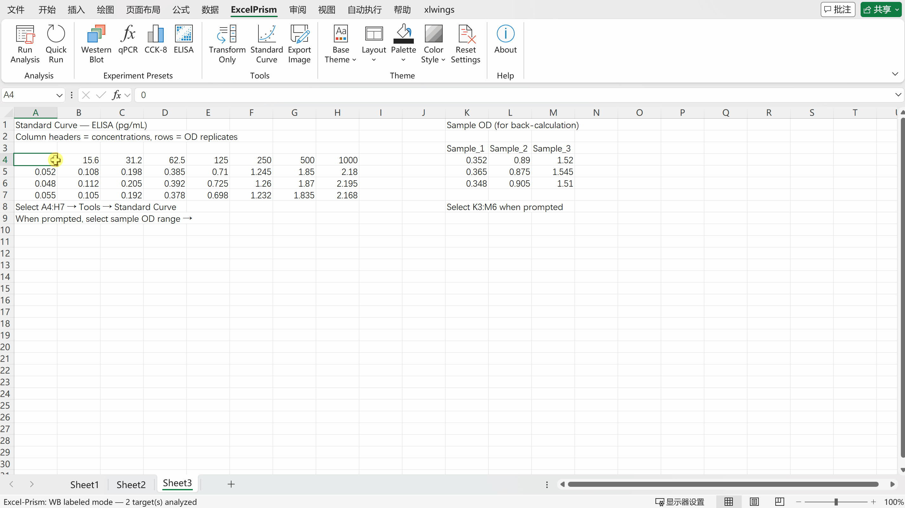

<h1 align="center">✨ XSTARS</h1>

<p align="center">
  <strong>Excel 内置统计分析与快速显著性出图工具</strong><br>
  <em>让数据的星光一眼可见。</em>
</p>

<p align="center">
  🔄 零切换 · 🧠 零门槛 · 💰 零成本
</p>
<p align="center">
  <a href="https://github.com/Frankkk1912/xstars/releases">📥 下载安装包</a> ·
  <a href="README.md">🇬🇧 English</a> ·
  <a href="#-快速开始">🚀 快速开始</a>
</p>


---

## 🤔 为什么选择 XSTARS？

> 🎓 组会明天下午就要开了，你终于跑完了 WB 实验，灰度值已经整理在 Excel 里。接下来你需要：打开 Prism 把数据粘贴过去、手动选统计方法、调整图表格式、导出图片再贴进 PPT…… 光是作图和统计就花了一个多小时，比做实验还累。
>
> **如果这些在 Excel 里一键就能搞定呢？**

**XSTARS** 是一款免费的 Excel 插件，能在你的电子表格内直接生成发表级图表，并自动完成统计检验。

不需要学习新软件，不需要导出数据，不需要写代码。

### 😩 科研作图的痛点

| 痛点 | 没有 XSTARS 时 |
|------|-------------------|
| 🔀 工具切换 | 从 Excel 复制数据 → 粘贴到 Prism/R → 做图 → 再贴回论文 |
| 🤯 统计选择焦虑 | "该用 t 检验还是 Mann-Whitney？"—— 手动检查正态性，自己判断，祈祷没选错 |
| 💸 费用 | GraphPad Prism：学生版 ~$300/年，机构版 ~$600+。或者用盗版，承担风险 |
| 📚 学习成本 | R/Python：几周入门。Prism：又一个新界面要熟悉 |

### 💡 解决方案 —— 三个零

| | 含义 |
|---|------|
| 🔄 **零切换** | 在 Excel 里选中数据 → 点击 → 图表直接出现在 Excel 中，数据不需要离开 |
| 🧠 **零门槛** | 自动检测正态性和方差齐性 → 自动选择正确的统计方法 → 自动绘制显著性标注。你不需要选 |
| 💰 **零成本** | 免费开源，一个安装包搞定，不需要安装 Python，没有授权费 |

---

## 🎬 演示

### ⚡ 快速出图 — 一键生成统计图表


---

## ⚔️ XSTARS vs. 其他方案

| | XSTARS | GraphPad Prism | R / Python |
|---|:---:|:---:|:---:|
| **💰 价格** | 🟢 免费 | 🔴 ~$300–600/年 | 🟢 免费 |
| **📊 在 Excel 内工作** | ✅ | ❌ | ❌ |
| **🖱️ 无需编程** | ✅ | ✅ | ❌ |
| **📦 无需安装 Python/R** | ✅（独立 .exe） | 不适用 | ❌ |
| **🤖 自动选择统计方法** | ✅ | ❌ 手动 | ❌ 手动 |
| **📐 显著性标注** | ✅ 自动 | ⚠️ 手动放置 | ❌ 需写代码 |
| **🧪 实验预设** | ✅ WB、qPCR、CCK-8、ELISA | ❌ | ❌ 自己搭建 |
| **🎨 期刊匹配主题** | ✅ 超过 1500 种风格组合 | ⚠️ 有限 | ❌ 需写代码 |
| **⏱️ 上手时间** | 🟢 几分钟 | 🟡 几小时 | 🔴 几周 |

> 💬 XSTARS 并非要在所有场景下取代 Prism。它聚焦于**最常见的实验室场景**：你做完实验，数据在 Excel 里，你需要一张带有正确统计的发表级图表 —— 越快越好。

---

## 🧰 功能特性

### 📊 图表类型
- **柱状散点图** — 均值柱状图 + 误差线（SEM / SD / 95% CI）+ 个体数据点
- **小提琴图** — 分布形态 + 可选散点叠加
- **折线图** — 各组均值连线

### 🤖 自动统计检验

不再纠结该用哪种检验！XSTARS 会自动对你的数据进行思考决策：

```
对每组数据：Shapiro-Wilk 正态性检验
       ↓
跨组检验：Levene 方差齐性检验
       ↓
自动选择合适的统计方法：
```

| 条件 | 2 组 | ≥ 3 组 |
|------|------|--------|
| 正态 + 方差齐 | t 检验 | ANOVA + Tukey HSD |
| 正态 + 方差不齐 | Welch t 检验 | Welch's ANOVA + Games-Howell |
| 非正态 | Mann–Whitney U | Kruskal–Wallis + Dunn |
| 配对（正态） | 配对 t 检验 | — |
| 配对（非正态） | Wilcoxon 符号秩 | — |

显著性标注（`*`、`**`、`***`、`****` 或精确 p 值）自动绘制。✨


> ⚠️ **小样本（N < 5）：** 极小样本下正态性检验不可靠——XSTARS 会跳过检验并默认假设正态。

### 🧪 实验预设

内置生物医学常用实验流程 —— 无需手动计算：

🔬 **Western Blot**
- 条带灰度值 → 倍数变化归一化
- 内参蛋白校正（如 GAPDH），逐泳道计算
- 多目标标签模式：每个蛋白独立出图，自动内参归一化

🧬 **qPCR (ΔΔCt)**
- 支持 ΔCt 或 Raw Ct 输入
- 自动计算 ΔΔCt → 2^(−ΔΔCt) 倍数变化
- 多基因标签模式，自动内参基因归一化

💊 **CCK-8 细胞活力**
- 空白扣除 → 活力百分比
- 可选 IC50 拟合（四参数 Logistic 曲线）
- 剂量-反应曲线，支持灵活坐标轴缩放

🧫 **ELISA**
- 标准曲线拟合（4PL/线性）
- 样本浓度反算
- 支持手动输入已有拟合参数

### 🔬 Western Blot — 条带定量到倍数变化



### 🧫 ELISA — 标准曲线拟合与浓度反算



### 🎨 期刊级主题系统

四个独立控件，**超过 1500 种风格组合**，总有一款匹配你的目标期刊：

| 控件 | 选项 |
|------|------|
| **🖌️ Base Theme** | Classic · B&W · Minimal · Dark |
| **📐 Layout** | 期刊排版预设 — Nature · Science · Cell · Lancet · NEJM · JAMA · BMJ（图表宽度、字体、字号） |
| **🎨 Palette** | 期刊风格配色方案（ggsci 风格） |
| **💧 Color Style** | 柔和 · 深色 · 鲜艳 · 低饱和 · 色盲友好 |

### 📤 导出

保存图表为高清**PNG**、**TIFF**、**SVG** 或 **PDF** —— 1200DPI可选，直接用于投稿。🎯

---

## 🚀 快速开始

### 方式 A：📥 安装包（推荐 —— 无需 Python）

1. 从 [Releases](https://github.com/Frankkk1912/excel-prism/releases) 下载 `XSTARS_Setup.exe`
2. 运行安装程序 —— 自动配置 Excel 插件
3. 打开 Excel → 功能区出现 **XSTARS** 选项卡
4. 选中数据（含表头）→ 点击 **Run** 🎉

> 💡 **第一次使用？** 打开安装包附带的 `XSTARS_Templates.xlsx`，里面已预置了覆盖所有图表类型和实验预设的示例数据——在任意 Sheet 上直接点击 Run，即可看到 XSTARS 的完整效果。

### 方式 B：🛠️ 开发者安装（需要 Python）

```bash
git clone https://github.com/Frankkk1912/xstars.git
cd xstars
pip install -e ".[dev]"
xlwings addin install
```

然后打开 `.xlsm` 工作簿并添加 VBA 回调 —— 参见 [ribbon/README.md](ribbon/README.md)。

---

## 📋 数据格式

以**宽格式**组织数据 —— 每列为一组，每行为一个重复：

| Control | Treatment A | Treatment B |
|---------|-------------|-------------|
| 1.2     | 2.3         | 3.1         |
| 1.4     | 2.1         | 2.9         |
| 1.1     | 2.5         | 3.3         |

多目标实验（WB/qPCR 标签模式）在第一列添加标签：

| Label  | Control | Treatment A | Treatment B |
|--------|---------|-------------|-------------|
| EGFR   | 1.2     | 2.3         | 3.1         |
| EGFR   | 1.4     | 2.1         | 2.9         |
| GAPDH  | 1.0     | 1.0         | 1.1         |
| GAPDH  | 1.1     | 0.9         | 1.0         |

选中范围（含表头）→ 点击 Run，搞定。✅

---

## ⚙️ 设置

所有选项通过选项卡式对话框配置：

| 选项卡 | 内容 |
|--------|------|
| **⚡ 常规** | 图表类型、误差线、数据点、配对模式、标注格式、比较模式 |
| **🎨 主题** | Base Theme · Layout · Palette · Color Style（均可从功能区独立调整） |
| **🧪 预设** | 实验类型（WB / qPCR / CCK-8 / ELISA）及专属选项 |
| **📤 导出** | 输出格式、DPI、文件路径 |

设置跨会话持久化，保存在 `~/.xstars/settings.json`。💾

---

## 📌 系统要求

- 🪟 Windows + Microsoft Excel
- **安装包模式**：无其他要求 —— `.exe` 已打包所有依赖
- **开发者模式**：Python ≥ 3.10

---

## 🤝 参与贡献

欢迎提交 Issue 和 Pull Request！

## 📄 许可证

[MIT](LICENSE) — 可免费用于学术和商业用途。

---

<p align="center">
  <sub>⭐ XSTARS · Excel-based Statistics Tool for Analysis, Rapid Significance · 让数据的星光一眼可见。</sub>
</p>
